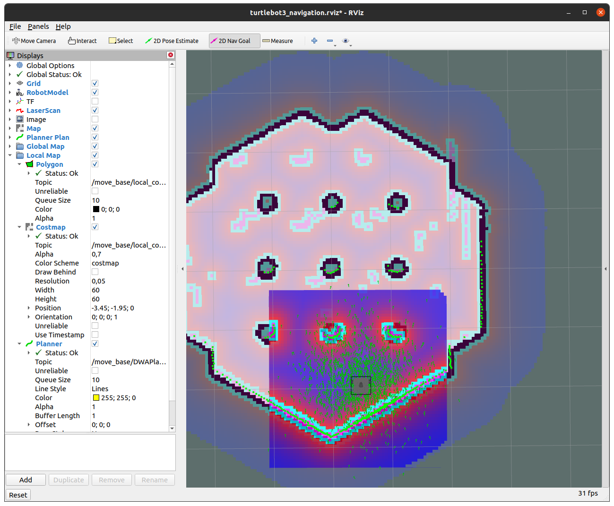

# Mapping dan Navigating SLAM Turtlebot3

SLAM (Simultaneous Localization and Mapping) adalah teknik yang digunakan untuk membuat peta sambil memperkirakan lokasi saat ini dalam suatu ruang yang tidak diketahui. SLAM dapat mengidentifikasi lingkungan sekitar dan secara bersamaan memperbarui posisi dan orientasi perangkat yang bergerak.

Turtlebot3 sendiri sudah builtin sensor SLAM / 360 Lidar yang bisa digunakan untuk mapping dan localization. Teknik SLAM bisa digunakan untuk menggantikan sensor GPS. Walaupun SLAM tidak se-akurat GPS apalagi RTK (Realtime Kinematic) tapi SLAM bisa digunakan di dalam ruangan indoor.

# Mapping

## 1. Install package yang diperlukan
Ada beberapa package yang perlu diinstall
```
sudo apt-get install ros-noetic-slam-gmapping ros-noetic-map-server ros-noetic-navigation
```

## 2. Source workspace dan pilih jenis turtlebot yang mau digunakan
Disini saya menggunakan jenis waffle_pi. Sebetulnya bebas mau pake yang mana, pake burger juga bisa karena sama - sama memiliki 360 lidar.
```
source ~/test_turtlebot/devel/setup.bash
export TURTLEBOT3_MODEL=waffle_pi
```

Perintah diatas bisa kita permanenkan dengan cara menambahkan perintah tersebut ke `.bashrc` dengan cara berikut:
```
echo "source ~/test_turtlebot/devel/setup.bash" >> ~/.bashrc
echo "export TURTLEBOT3_MODEL=waffle_pi" >> ~/.bashrc
```
Dengan menambahkan 2 perintah tersebut, terminal akan langsung mengenali source dan model turtlebot3 yang mau digunakan. Kalau mau menonaktifkan, bisa edit di `.bashrc` yang terletak pada direktori `$HOME`

## 3. Jalankan Turtlebot3 di Gazebo
Disini saya menggunakan `turtlebot3_world.launch` yang sudah memiliki obstacle agar bisa di mapping. Pada Terminal-1 jalankan perintah berikut:
```
roslaunch turtlebot3_gazebo turtlebot3_world.launch
```

## 4. Jalankan Teleoperation Node
Teleop node digunakan untuk menggerakkan Turtlebot3 menggunakan key WASD. Pada Terminal-2 jalankan perintah berikut:
```
roslaunch turtlebot3_teleop turtlebot3_teleop_key.launch 
```

## 5. Jalankan SLAM Node
Mapping menggunakan RViz. Pada Terminal-3 jalankan perintah berikut:
```
roslaunch turtlebot3_slam turtlebot3_slam.launch
```
Akan muncul tampilan hasil mapping pada RViz tetapi belum nampak sepenuhnya, ini dikarenakan TurtleBot3 belum keliling keseluruhan lokasi.

## 6. Aktifkan Terminal Teleop Node
Mapping dengan cara keliling ke seluruh lokasi dengan cara menggerakkan Turtlebot3 dengan WASD. Pastikan semua lokasi terlihat di RViz.

## 7. Simpan Hasil Mapping
Simpan hasilnya dengan cara membuka terminal baru dan ketik perintah berikut:
```
rosrun map_server map_saver -f ~/map
```

Outputnya kurang lebih seperti ini:
```
[ INFO] [1730030221.343561111]: Waiting for the map
[ INFO] [1730030221.570324000]: Received a 384 X 384 map @ 0.050 m/pix
[ INFO] [1730030221.570348567]: Writing map occupancy data to /home/supernova/map.pgm
[ INFO] [1730030221.572619938, 411.947000000]: Writing map occupancy data to /home/supernova/map.yaml
[ INFO] [1730030221.572716571, 411.947000000]: Done
```
File akan tersimpan di direktori `$HOME`. Sampai pada titik ini, kita telah berhasil mapping dengan Turtlebot3.

# Navigating
Setelah selesai melakukan mapping, kita bisa menggunakan map yang sudah kita buat.

## 1. Jalankan Turtlebot3 di Gazebo
Pada terminal-1:
```
roslaunch turtlebot3_gazebo turtlebot3_world.launch
```

## 2. Buka Navigation Node
Pada langkah menyimpan map sebelumnya, file map disimpan pada direktori `$HOME` yang bernama `map.yaml`. Jalankan perintah dibawah pada terminal-2:
```
roslaunch turtlebot3_navigation turtlebot3_navigation.launch map_file:=$HOME/map.yaml
```

## 3. Pose Estimate
Setelah RViz terbuka, klik 2D Pose Estimate pada bagian atas dan klik dimana posisi dan arah Turtlebot3 berada. Atur sampai map yang sudah dibuat cocok dengan peta acuan.




## 4. Navigate
Klik 2D Nav Goal pada bagian atas dan klik lokasi dan arah goal yang akan dicapai.


Referensi:
- https://www.youtube.com/watch?v=UzOoJ6a_mOg
- https://emanual.robotis.com/docs/en/platform/turtlebot3/slam/